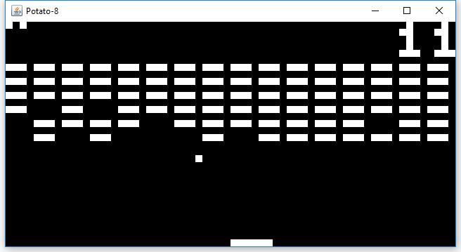
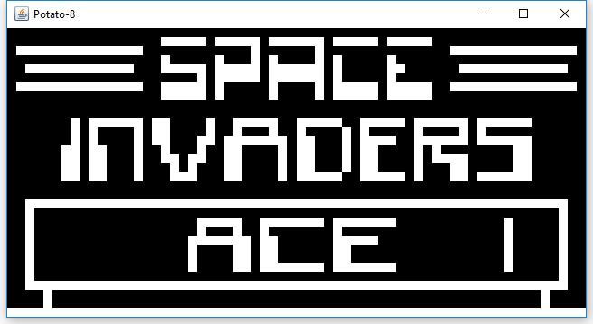
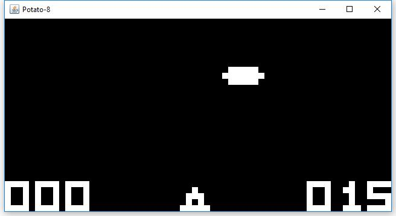
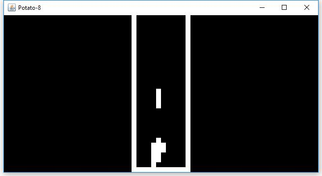
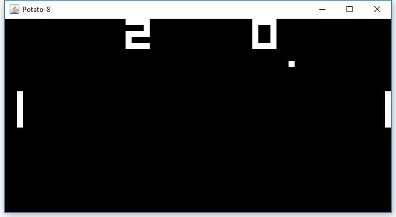

# Potato-8

Potato-8 is a Chip-8 emulator written completely in native Java. It emulates core functions of the Chip-8 such as the instruction set and video.  It's a small exercise that shows how efficient and clean Java can be with advanced projects.

# Building
Potato-8 can be build using gradle command: 

    gradle desktop:jar
    
The built jar will be located in directory `/desktop/build/libs/`

# Usage 
Use:

    java -jar potato8-desktop.jar ROM_PATH [OPTIONAL SCALE]
  
The optional scale parameter is used to scale the window size by a positive integer since the default size of the Chip-8 is 64x32 which is pretty small so putting the integer 2 will scale the window size to 128(64 * 2)x64(32 * 2). The default scaling is 10(640x320).

# Keyboard

The original Chip-8 keyboard layout is defined as hexadecimal keypad mapped to the keyboard as shown below:

|   |   |   |   |
|---|---|---|---|
| 1 | 2 | 3 | C |
| 4 | 5 | 6 | D |
| 7 | 8 | 9 | E |
| A | 0 | B | F |

| Original | Keyboard |
|----------|----------|
| 1        | 1        |
| 2        | 2        |
| 3        | 3        |
| C        | 4        |
| 4        | Q        |
| 5        | W        |
| 6        | E        |
| D        | R        |
| 7        | A        | 
| 8        | S        |
| 9        | D        |
| E        | F        |
| A        | Z        |
| 0        | X        |
| B        | C        |
| F        | V        |

# Screenshots

# Resources

* [Thomas P. Greene's Cowgod Documentation](http://devernay.free.fr/hacks/chip8/C8TECH10.HTM)
